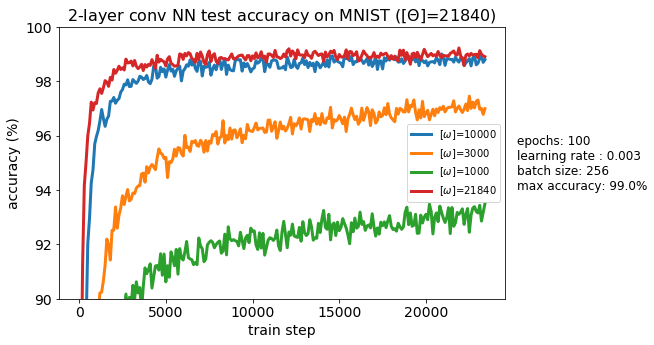
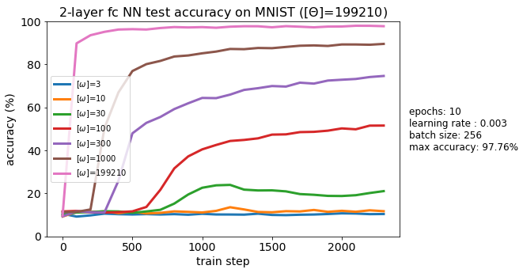

subspace-nn: neural network optimization in fewer dimensions
=======
Sam Greydanus. June 2017. MIT License.

_Written in PyTorch_

About
--------
We train several MNIST classifiers. We introduce subspace optimization on some of them. The idea is to optimize a weight space (call this **'omega space'**) of, say, 1000 parameters and then project these parameters into the full space (call this **'theta space'**) of, say, 200,000 parameters. We're interested in studying the convergence properties of this system.

* [subspace-nn-conv](https://nbviewer.jupyter.org/github/greydanus/subspace-nn/blob/master/subspace-nn-conv.ipynb): a 784 -> (10,5x5) -> (20,5x5) -> 50 -> 10 MNIST classifier implemented in PyTorch with subspace optimization. Optimization occurs in this low dimensional space (**omega space**), and then the weights are projected into the full parameter space (**theta space**). We train in subspaces of dimension [3, 10, 30, 100, 300, 1000] and compare to a model trained in full (theta) parameter space.

* [subspace-nn-fc](https://nbviewer.jupyter.org/github/greydanus/subspace-nn/blob/master/subspace-nn-fc.ipynb): a 784 -> 200 -> 200 -> 10 MNIST classifier implemented in PyTorch with subspace optimization. Optimization occurs in this low dimensional space (**omega space**), and then the weights are projected into the full parameter space (**theta space**). We train in subspaces of dimension [3, 10, 30, 100, 300, 1000] and compare to a model trained in full (theta) parameter space.

* [mnist-zoo](https://nbviewer.jupyter.org/github/greydanus/subspace-nn/blob/master/mnist-zoo.ipynb): several lightweight MNIST models that I trained to compare them with the models I optimized in 'omega space':

Framework | Structure | Type | Free parameters | Test accuracy 
:--- | :---: | :---: | :---: | :---:
PyTorch | 784 -> 16 -> 10 | Fully connected | 12,730 | 94.5%
PyTorch | 784 -> 32 -> 10 | Fully connected | 25,450 | 96.5%
PyTorch | 784 -> (6,4x4) -> (6,4x4) -> 25 -> 10 | Convolutional | 3,369 | 95.6%
PyTorch | 784 -> (8,4x4) -> (16,4x4) -> 32 -> 10 | Convolutional | 10,754 | 97.6%

Dependencies
--------
* All code is written in Python 3.6. You will need:
 * NumPy
 * Matplotlib
 * [PyTorch 0.2](http://pytorch.org/): easier to write and debug than TensorFlow :)
 * [Jupyter](https://jupyter.org/)
